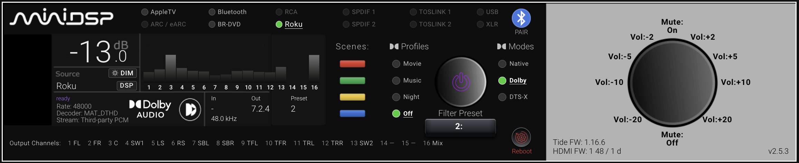

# Minidsp-Tide16-ControlCard

[![hacs][hacs-badge]][hacs-url]

A photoreal front panel for the miniDSP Tide16 in Home Assistant - with a
**live 16-channel output meter**, and every control on it wired to the
device.



*My system, mid-session, meter live.  It runs 7.2.4, so 13 outputs are
assigned and the legend names them; yours will show your own layout.*

## What's here

| | |
|---|---|
| `custom_components/tide16/` | The integration: a WebSocket client for the Tide16, every entity the panel needs, and the card itself |
| `custom_components/tide16/api/` | The protocol on its own, with no Home Assistant imports - runnable from a terminal |
| `custom_components/tide16/frontend/` | The card - `custom:tide16-panel` - plus the nine `picture-elements` elements it is built from, the plate and the glyphs.  Served by the integration at `/tide16_static/` |
| `lovelace/tide16-panel.yaml` | An example view, for the dedicated full-page look.  Not needed to use the card |
| `docs/panel-layout.annotated.yaml` | Where every element box on the plate is measured and explained.  The card carries the same geometry as data; `tools/build_layout.py` writes it and `tools/check_layout_sync.py` proves the two agree |

## Install

**One thing, from HACS.**

1. HACS > ⋮ > Custom repositories > `https://github.com/speedtoys/Minidsp-Tide16-ControlCard`, type **Integration**.  Download it and restart.
2. Settings > Devices & services > Add integration > **miniDSP Tide16**.  It sweeps your subnet and offers whatever answers as a Tide16 - pick it, or type an address.
3. On any dashboard: Edit > Add card > **miniDSP Tide16 Panel**.

That's it.  There is no Lovelace resource to add, nothing to copy into
`www/`, no YAML to paste and no `?v=` cache-buster to bump - the
integration serves the card and the plate art itself, and the module URL
carries its own version.

The card goes wherever you want it: a section of a sections view, a
normal masonry view, or a panel view of its own.  In a sections view it
asks for the full width - the plate is very nearly 5:1, and a
default-width section would letterbox it into something unreadable.

There are no third-party dependencies.  **card-mod is no longer needed**
- v2.1.0 moved the container and the card-chrome overrides into the card
itself.

Two options, both optional:

```yaml
type: custom:tide16-panel
scale: 0.75      # fraction of the available width. Default 1.
outline: none    # CSS outline around the plate. Default "2px solid #FFFFFF".
```

`scale` is a width, not a `transform`: the layout follows the artwork, so
there is no band of dead space under a shrunken plate.  It earns its keep
in a panel view, which hands the card the whole window; in a section, the
section has already decided how wide the card is.

For the dedicated full-page view the screenshot was taken on, paste
[`lovelace/tide16-panel.yaml`](lovelace/) into a dashboard - it is a dozen
lines now.

### Finding the unit

Setup sweeps the local subnet for the Tide16's port, then opens a WebSocket to
everything that answers and asks `get_settings`.  What you are offered is a
unit that identified itself, not an address with a port open.  A /24 takes
about a second and a half; networks larger than 512 addresses are skipped
rather than swept.

**This is a sweep rather than discovery because the unit announces itself
nowhere.**  Measured on a live one: no SSDP response, no mDNS service, and its
only name on a network is whatever that network's DHCP server chose to call it
- a fact about the network, not the device.  There is nothing for Home
Assistant's own discovery to catch.

Typing an address always works, for a unit on another subnet.  And if nothing
is found, the likeliest reason is that the unit is asleep: **a Tide16 in
standby leaves the network entirely** and cannot be found by anyone until it
is switched on.

The scan lives in the Home-Assistant-free API layer, so it runs from a
terminal too:

```
cd custom_components/tide16
python3 -m api --scan              # this machine's subnet
python3 -m api --scan 10.0.0.0/24  # another one
```

### Upgrading from v1.x

v1 was a dashboard card that needed
[@GaelFrance's integration](https://github.com/GaelFrance/MiniDSP-Tide-16---HomeAssitant-Integration)
plus a patch, three python scripts, a package of template sensors and
five stanzas of `configuration.yaml`.  v2 replaced all of it.

1. Remove the old HACS entry (it was type **Dashboard**) and add the repo again as an **Integration**.
2. Delete the old config entry for `minidsp_tide16`, then its `custom_components/minidsp_tide16/` folder.
3. Delete `packages/tide16_panel.yaml`, `scripts/tide16_*.py`, the `command_line` and `shell_command` stanzas, the `recorder:` exclusion for `sensor.tide16_channel_levels`, and the `/local/tide16/` resource row.
4. Add this integration and take the new view.

Do the removals **before** adding this integration, or Home Assistant will
hand the new entities `_2` suffixes because the old registry rows still
hold the names.  Entity ids are otherwise unchanged - `sensor.tide16_status`,
`number.tide16_volume` and the rest are the same names, so recorder history
carries straight over.

The one entity that does not come back is `sensor.tide16_channel_levels`.
Sixteen floats four times a second was never state worth storing; the meter
subscribes to them over the websocket now, which is also why the recorder
exclusion is gone.

## The elements

The panel card is the supported way in, and everything below is what it is
made of.  Reach for these directly only if you are building your own
layout on the plate.

All eight live in the one JS file.  Seven of them are used the same way:
as elements inside a `picture-elements` card, each framed by its own box.

```yaml
type: picture-elements
image: /tide16_static/plate-v2.png
elements:
  - type: custom:tide16-bars
    style:
      left: "17.487%"
      top: "21.500%"
      width: "15.628%"
      height: "29.250%"
      transform: translate(0, 0)
```

**`transform: translate(0, 0)` is not optional.** `picture-elements`
centres elements on their `left`/`top` by default
(`translate(-50%, -50%)`); without the override every element sits half a
box up and to the left of where you put it.

**The panel follows the hardware.**  As of v2.4.0 the layout is anchored to
a photograph of a running unit rather than to a design mock: there is no
"Program" or "Listening" cell, the meter runs the full width of the screen,
and the bottom strip is `ready` and a decoder badge on the left with an
In / Out / Preset table on the right.  `docs/panel-layout.annotated.yaml`
carries the measurements and the reasoning.

**The box is the geometry.** Sizes inside each element are in `cqw` -
percent of the card's width - so the whole panel scales together at any
display size.  On the bundled 1990x400 plate, 1 canvas px ≈ 0.0503 cqw.
Moving or resizing a box changes spacing, never proportions.

### `custom:tide16-panel` - the whole panel

The one that goes on a dashboard.  It carries the complete measured layout
and builds a real `picture-elements` card from it, so what you get is the
panel in the screenshot, from one line of config.

```yaml
type: custom:tide16-panel
```

It registers itself in the card picker, reports `columns: full` to a
sections view, and needs no other card installed.

**Why it is a card and not a view you paste.**  A thousand lines of
measured boxes in someone's dashboard config is a thousand lines that
cannot be fixed by an update.  Carried in the module, the geometry ships
with the integration and a release can correct it.

### `tide16-bars` - the 16-channel meter

Frames the **meter window**, the area the bars sweep.  Draws its own
`1`-`16` numbers below the baseline, off the same pitch as the bars, so
they cannot drift out of register with them.

| Option | Default | |
|---|---|---|
| `subscribe` | `tide16/levels/subscribe` | The integration's websocket feed the bars read |
| `ceiling_entity` | `number.tide16_volume` | Entity whose value is full scale |
| `range_db` | `40` | Height of the window, in dB below that ceiling |
| `ceiling_db` / `floor_db` | `0` / `-60` | Fallback pair, used only when `ceiling_entity` is unset or unavailable |
| `transition_ms` | `260` | Bar animation, ≈ the 250 ms push |
| `numbers` | `true` | Draw the 1-16 labels |
| `numbers_size` / `numbers_gap` / `numbers_color` / `numbers_weight` | `0.748cqw` / `0.236cqw` / `#FFFFFF` / `500` | |

### `tide16-channels` - the output legend

One compact row of `1 FL  2 FR  3 C …` under the plate, naming what each
output is assigned to.  Folds into two columns below `stack_below`,
where the type has hit its px floor and a single row would overrun.
Every chip carries the full device name as hover text.

| Option | Default | |
|---|---|---|
| `entity` / `attribute` | `sensor.tide16_channel_levels` / `channel_names` | |
| `channels` | `16` | Only used with `show_unassigned` |
| `show_unassigned` | `false` | Draw `—` for outputs the device left unassigned |
| `label` | `Output Channels:` | Set `null` for no heading |
| `font_size` / `min_font_size` | `1.2cqw` / `11px` | |
| `gap` / `column_gap` | `1.35cqw` / `2.4cqw` | |
| `stack_below` | `900px` | Card width at which the row folds |
| `color` / `index_color` / `label_color` | `#B7B8B8` / 42% / 60% of it | Names, numbers, heading |

### `tide16-readout` - a titled block of live values

A heading plus any number of rows, each `{label?, entity, attribute?}`.
Used for the Program and Preset blocks.

| Option | Default | |
|---|---|---|
| `title` / `title_color` / `title_size` / `title_gap` | `null` / `#808080` / `0.805cqw` / `0.15cqw` | `#808080` is what the plate prints its own baked labels in |
| `color` / `size` / `row_gap` | `#B7B8B8` / `0.45cqw` / `0.10cqw` | |
| `align` | `left` | |
| `rows` | `[]` | |

### `tide16-inputs` - the source selector

A grid of dot-and-label cells, filled **down** each column and then
right, so an alphabetical list reads in order when it is arranged as
columns of two.  The live source is read off an entity attribute and
matched against each item's `text` (or its `value`, when the label
differs from what the device reports).

Selection goes through `media_player.select_source`, not the
`button.tide16_source_*` entities: those are named after the physical
inputs (`hdmi_2`, `spotify`) while the device reports the user's
**renamed** sources ("Roku", "Comcast"), so the names in `source_list`
are the only thing that maps one-to-one with what the panel displays.

| Option | Default | |
|---|---|---|
| `columns` / `rows` | `6` / `2` | |
| `row_gap` / `dot` / `dot_gap` / `size` | `0.503cqw` / `0.653cqw` / `0.302cqw` / `0.704cqw` | |
| `color` / `background` / `border` | `#B7B8B8` / `#333333` / `1px solid #666666` | |
| `active_entity` / `active_attribute` | `null` / `source` | Which entity reports the live source |
| `active_color` / `active_size` | `#FFFFFF` / `null` | The live source is white and underlined; `active_size` also makes it bigger.  `null` keeps it at `size` |
| `items` | `[]` | `{text, value?, tap?, hint?}` |

Quote the `border` value.  Unquoted, YAML reads `#666666` as a comment
and hands over a bare `1px solid`, which CSS completes with
`currentColor` - a white border, silently.

### `tide16-buttons` - the scene column

A vertical stack of fixed-ratio buttons.  The ratio is the point: the
element sizes itself from the box **width** via `aspect-ratio`, so
re-positioning or resizing the box can never produce squashed buttons -
only different spacing.

`gap` picks how the slack is spent.  A `justify-content` keyword
(`space-between`, the default) spreads the buttons across the box; a
length instead sets a fixed gap and pins the stack to the box **bottom**.
An optional `title` rides above the box, outside it, so a heading can
never drag the buttons off whatever edge you aligned them to.

| Option | Default | |
|---|---|---|
| `ratio` / `radius` | `7 / 2` / `3px` | |
| `gap` | `space-between` | Keyword, or a length |
| `title` / `title_size` / `title_color` / `title_gap` | `null` / `1.05cqw` / `#BFC0C0` / `0.5cqw` | |
| `buttons` | four colours | `{color, label?, hint?, tap}` |

### `tide16-knob-labels` - text around a knob, by clock position

Give the box the **knob's** bounding square and every label places itself
outside that circle.  That is the whole point: one box to measure, and
`gap` is then a real clearance from the knob's edge that stays honest at
every angle, instead of eight hand-tuned `left`/`top` pairs that drift
the moment the card is rescaled.

Each label is `{at, text, tap?, hint?}`, where `at` is a clock position and
`text` takes a list as readily as a string - a list stacks, one row per
entry, which is how `Mute:` / `On` is drawn.  A **fraction** is a fraction
of an hour, so `4.5` is half past four - the 135 degree diagonal, which
whole hours cannot reach.

| Option | Default | |
|---|---|---|
| `gap` | `0.381cqw` | Clearance from the knob's edge |
| `size` / `weight` / `color` / `line_gap` | `1.05cqw` / `400` / `#000` / `0.05cqw` | |
| `labels` | `[]` | |

### `tide16-glyph` - one PNG, with a tap and hover text

For the power, reboot and Bluetooth marks.  It exists because
`picture-elements`' own `image` element can't be hovered reliably: it
accepts a `title`, but hangs it on the inner `<hui-image>` while its
clickable wrapper puts another div over the top, so the cursor lands on
an element with no title in its ancestry and no tooltip ever appears.
Owning the element puts the title on the host, which *is* the hover
target.

`{image, hint?, tap?}`.  Untapped it takes no pointer events at all, so
it can't swallow a click meant for the plate underneath.

`color_entity` paints the art from live state.  The PNG stops being an
image and becomes a **mask**: its alpha is the shape and the colour is the
element's own background, so one file serves both states and the hex is
exact rather than whatever a filter chain lands on.  It wants flat line art
on transparency, which is what the plate's glyphs are.  Anything outside
`on_states` is off - including a missing entity, `unknown` and
`unavailable`, which for a unit that leaves the network in standby is the
only honest reading.

`busy_colors` makes a tap flash the glyph until the thing it waits on
answers again.  A reboot takes the Tide16 off the network for about half a
minute and the whole panel dashes out while it is gone, so without this the
button looks like it did nothing; the cycle is the progress bar.  Note
`busy_live_states`: through a reboot the media_player reports `off`, *not*
`unavailable`, so only an explicit list of live states can tell a rebooting
unit from a running one.  The run also has to see the entity go down before
a live reading may end it - for the first seconds after the press the unit
is still answering.  Either exit lands back on the resting colour.

| Option | Default | |
|---|---|---|
| `button` / `icon_scale` | `false` / `0.8` | Sinks the glyph into a concave panel dish |
| `color` | - | One flat colour, masked |
| `color_entity` / `color_on` / `color_off` / `on_states` | - / `#BFC0C0` / `#BFC0C0` / `['on']` | Colour from live state |
| `busy_colors` | - | Colours a tap cycles through |
| `busy_interval` / `busy_min_steps` / `busy_timeout` | `1000` / `5` / `60000` | ms / steps / ms |
| `busy_entity` / `busy_live_states` | `color_entity` / `['on']` | What "answering again" means |

## Hover text

Every control on the panel carries it, and it says what the click will
**do** rather than repeating what you can already read - `Volume down
2 dB`, not `Vol:-2`.  Sources get `Select source: <name>` for free; the
rest take an optional `hint`.  On a colour-only scene button the hint is
the only name the thing has, so it's worth setting.

These are native `title` tooltips: no dependency, no layout risk, and no
way to clip them at the edge of the plate - at the cost of the browser's
own delay before they appear.

## The scene buttons are the *device's* scenes

Worth being explicit, because the four coloured buttons look like
something you'd wire to whatever you like.  The Tide16 stores four scene
slots itself - a whole-box snapshot of source, volume, Dirac preset,
Dirac on/off, bass management, upmixer and the Dolby/DTS settings - and
names them by the colours printed on its front panel.  Red, green,
yellow, blue is index 0-3, which is exactly the colour order the card
draws.  `button.tide16_scene_*` recalls them.

Note the asymmetry in the device API, which is easy to get wrong: it
**recalls** with `set_scene` and **overwrites** with `save_scene`.  The
stock web UI at `http://<host>:5050` only ever sends `save_scene` - its
"Save current" swatches - so the endpoint that reads like the obvious one
is the destructive one.  Nothing in this repo sends it: a mis-tap would
silently replace a stored scene with the current state, and the device
keeps no undo.  Save from the stock UI.

Recalling a slot that was never saved is a no-op, so buttons for slots
you haven't populated simply do nothing.

## Why the meter looks and behaves the way it does

**The gradient is anchored to the meter box, not to each bar.** In the
original artwork a short bar starts dimmer than a tall one, because all
the bars are windows onto one shared top-to-bottom gradient spanning the
full meter height.  The card paints that gradient over a full-height
element and reveals only the bottom slice with `clip-path`, so it never
moves or rescales as the level changes.  Giving each bar its own
height-relative gradient looks obviously wrong next to the plate.

**The scale slides with the volume.** None of the dB options describe the
Tide16's own range, which is -127.5 to 0 dB with silence metering at
exactly -122.5.  They describe the **window the bars draw** - which dB
value puts a bar at zero height and which fills it.

Output level tracks the master volume: with real content at -42 dB
master, the loudest channel peaked at -42.9 dB.  So full scale *is* the
volume setting, and the window slides with it:

```
ceiling = <ceiling_entity>          e.g. -42 dB
floor   = ceiling - range_db        e.g. -82 dB
```

A window fixed in absolute dB reads completely differently at every
volume, which is the trap that makes home-made meters look broken.  Turn
that off with `ceiling_entity: null` and the fixed
`floor_db`..`ceiling_db` pair is used instead - but pick your own values
if you do.  The `-60`..`0` defaults are only a fallback for when the
volume entity is missing, and they will read low at normal listening
levels.

**This is interim.** Anchoring to the volume entity is an inference, not
a reading - the device does not currently report its meter reference over
the API.  When miniDSP exposes those values and the integration picks
them up, these options become mirrors of real device state instead of
estimates, and `range_db` in particular should stop being a number anyone
tunes by eye.  The option names are chosen so that swap is a default
change rather than a breaking one.

**It only polls fast while you're looking.** While the element is on
screen it subscribes to the integration's levels feed, and the
coordinator raises the device poll to 4 Hz only while at least one
subscriber exists.  Off screen it unsubscribes and the rate drops back,
so nothing can leave the device being polled hard at nobody - and closing
the tab is the unsubscribe, with no timer to lapse and no state that can
get stuck fast.  Both an `IntersectionObserver` (view switched, scrolled
away) and `visibilitychange` (tab hidden, laptop asleep) gate it -
neither alone catches both cases.

The levels are never entity state.  Sixteen floats four times a second
would be a `recorder` problem and a history nobody wants; the frames go
straight from the coordinator to the subscribed browsers.

## Reading the meter

During true silence every channel reads exactly `-122.5` dB, so the bars
sit at zero.

Bars past the end of your layout also sit at zero, and that is not the
same thing.  The device reports which speaker each output is assigned to,
so `sensor.tide16_channel_levels` carries a `channel_names` attribute
alongside `channels`:

```
1  LeftFront          9   LeftFrontOverhead
2  RightFront         10  RightFrontOverhead
3  Center             11  Sub2
4  Sub                12-16  not present
5  LeftSurround
6  RightSurround
7  RearLeftSurround
8  RearRightSurround
```

That is a 7.2.2 layout, so the device returns exactly 11 entries and
outputs 12-16 are simply **absent** from the map - unassigned, not
assigned-and-silent.  Both read `-122.5`, which is why the names are
worth having.  `tide16-channels` draws exactly this list.

`channel_names` is positional against `channels` and is **shorter**
whenever the layout uses fewer than 16 outputs, so `zip()` the two rather
than indexing blindly.  Entries are `null` for an output the device left
unassigned.  If you have renamed ports on the Tide16 itself, those names
win over the stock speaker names.

The trap: an idle link looks identical to a working one at every level
*except* the metering itself.  The `sensor.tide16_stream` entity reports
the negotiated format and `speaker_config` reports 7.2.2 with nothing
playing at all.  Only the metering moving proves playback.

## Credits and licensing

The integration, the card, the Lovelace view and the plate edits are
original work, MIT licensed.  The WebSocket client was written against
miniDSP's published API and a recorded session with the hardware; no code
from any other implementation is in it.

Through v1.x this repo was a card that sat on top of
[@GaelFrance's integration](https://github.com/GaelFrance/MiniDSP-Tide-16---HomeAssitant-Integration)
(MIT), with a patch for the metering and scene endpoints it did not
reach.  That is where this panel started, and the debt is worth stating
plainly even though v2 no longer depends on it.

### Image assets - what the MIT grant does NOT cover

See [`NOTICE`](NOTICE) for the full statement.  In short: **the MIT
license applies to the source code only** - `custom_components/tide16/**/*.py`,
the card JS, `lovelace/`, `tools/`, and the brand icon.  It does not grant
any rights in the image assets.  Every binary shipped in this repo is
listed below.  With the one exception of the brand icon, none of them are
original artwork, so treat the whole of
`custom_components/tide16/frontend/` and `docs/` as excluded unless you
have confirmed otherwise for the file you want.

| File | What it is | Status |
|---|---|---|
| `custom_components/tide16/frontend/plate-v3.png` | The front-panel artwork as the hardware actually draws it - `plate-v2.png` with the "Program" and "Listening" labels painted out, since the shipping firmware shows neither | Depicts a miniDSP product.  **Excluded** |
| `custom_components/tide16/frontend/badge-dolby-audio.png`, `…/badge-dolby-atmos.png`, `…/badge-dtsx.png` | The decoder lockups shown along the bottom strip, keyed to white on transparency | Third-party marks, provenance unconfirmed.  **Excluded** |
| `custom_components/tide16/frontend/dirac-white.png` | The circled Dirac mark, in the white the hardware uses | Third-party mark, provenance unconfirmed.  **Excluded** |
| `custom_components/tide16/frontend/plate-v2.png` | Front-panel artwork of the miniDSP Tide16, redrawn and stripped of its baked-in readings so live values can be painted back on | Depicts a miniDSP product.  **Excluded** |
| `custom_components/tide16/frontend/plate.png` | The original photographic plate, superseded by `plate-v2.png` and kept only for history | Photograph of a miniDSP product.  **Excluded** |
| `custom_components/tide16/frontend/dolby.png` | The Dolby double-D, used as the word "Dolby" in the profile heading.  Supplied by the repo owner; keyed off its background and recoloured here | Third-party mark, provenance unconfirmed.  **Excluded** |
| `custom_components/tide16/frontend/dolby-atmos.png` | The Dolby Atmos lockup shown in the LCD when Atmos is decoding | Third-party mark, provenance unconfirmed.  **Excluded** |
| `custom_components/tide16/frontend/dirac.png`, `custom_components/tide16/frontend/dirac-a.png` | The Dirac Live mark, lit when Dirac is engaged | Third-party mark, provenance unconfirmed.  **Excluded** |
| `custom_components/tide16/frontend/bt.png` | The Bluetooth mark on the pairing control.  Supplied by the repo owner, background-stripped and recoloured here | Third-party mark, provenance unconfirmed.  **Excluded** |
| `custom_components/tide16/frontend/reboot.png` | The reboot glyph.  Supplied by the repo owner as line art, recoloured and cropped here | Third-party icon art, provenance unconfirmed.  **Excluded** |
| `custom_components/tide16/frontend/power.png` | The standby glyph, recoloured to match the reboot one | Provenance unconfirmed.  **Excluded** |
| `custom_components/tide16/brand/icon.png`, `…/icon@2x.png` | The brand icon: a seven-bar level meter, drawn from scratch by `tools/make_brand_icon.py` in the card's own palette | **Original work.  MIT, like the code** |
| `docs/screenshot.png` | A photograph-equivalent render of the running card | Contains every mark above.  **Excluded** |

Recolouring, cropping and background-stripping are edits, not authorship:
nothing in that table became MIT by being processed here.  If you intend
to redistribute this repo, or to ship it anywhere the above matters,
either confirm each file's own licensing or replace it - the card reads
every one of them from a path in the YAML, so substituting your own art
is a one-line change per file.

The names miniDSP, Tide16, Dolby, Dolby Atmos, DTS:X, DIRAC, Dirac Live,
HDMI and Bluetooth are trademarks of their respective owners, used here
only to depict the device this card controls.  Not affiliated with,
endorsed by, or sponsored by miniDSP, Dolby Laboratories, Dirac, DTS,
HDMI Licensing or Bluetooth SIG.

[hacs-badge]: https://img.shields.io/badge/HACS-Custom-41BDF5.svg
[hacs-url]: https://github.com/hacs/integration
